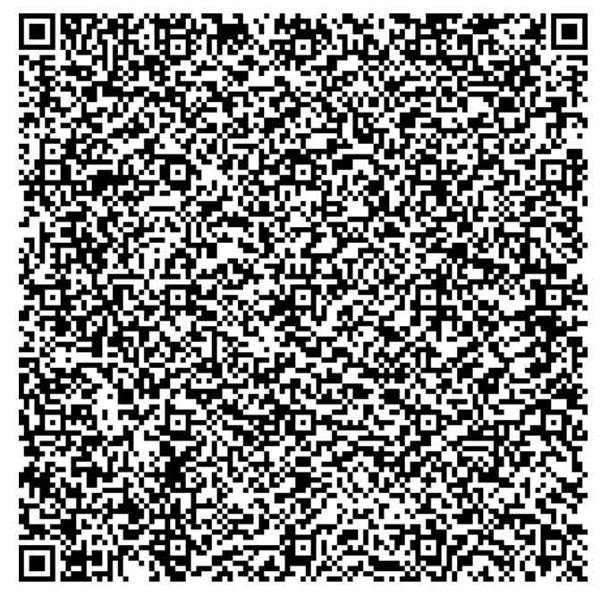

## Dummy Backend 

Here is the source of thruth of the dummy backend data.
If data changes here, it must be updated manually in `/Raspberry/StepEngineControl`. If necessary also in `/iOS/Trittstufe/Trittstufe/Model/DummyBackendData.swift`, or you read the data via QR code in the app. 

## Current QR-Code

