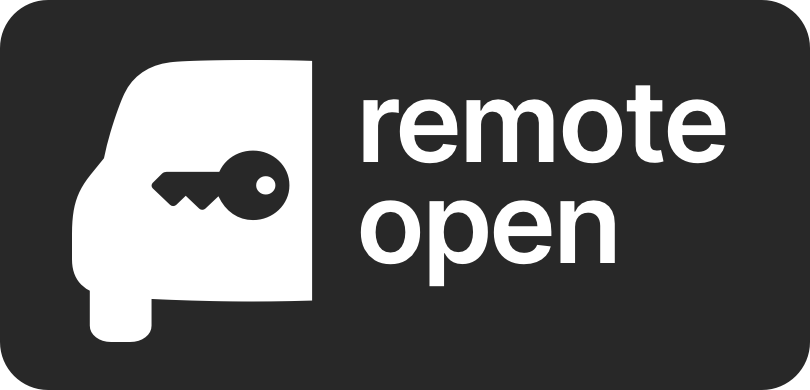
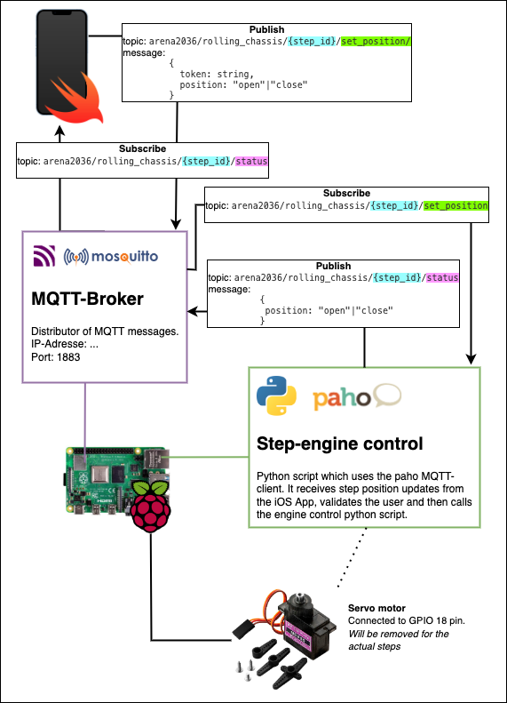
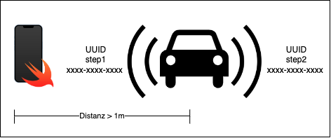
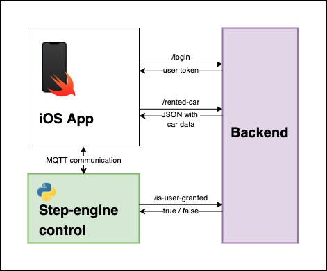

# App controlled step for FlexCAR

## Introduction
 For the FlexCAR project, two steps are being developed that can be retracted and extended using an iOS app. For safety reasons, there is a requirement that the user can only extend the step facing him. In this paper, technologies were investigated that can be used to localize objects. For this reason, a concept has been developed that uses the technology of Bluetooth beacons and NFC tags to ensure the immediate proximity to the vehicle and to determine the facing side of the vehicle. A prototype has been developed which uses the Bluetooth Beacons to measure the distance to the vehicle. However, there is the problem of the technology being sensitive to interference, so the NFC tags are used as a backup strategy.   

## Structure
The repository is structured into the following three components:
1. **1_iOS**: Contains the Trittstufen-App and the iBeacon-App
2. **2_Raspberry**: Contains the MQTT client for the step-engine control as well as an instruction to run the MQTT Broker Mosquitto on the Raspberry.
3. **3_Backend**: The dummy data model, which contains both vehicle information and user data. 

## Requirements
- iPhone (iOS 15) with the [Trittstufe-App](https://gitlab.mi.hdm-stuttgart.de/ns162/trittstufe/-/tree/main/1_iOS/Trittstufe) running
- Raspberry Pi as [Mosquitto Broker](https://gitlab.mi.hdm-stuttgart.de/ns162/trittstufe/-/tree/main/2_Raspberry)
- Each step must be connected to a Raspberry Pi. For each step there must be one [Step-engine control](https://gitlab.mi.hdm-stuttgart.de/ns162/trittstufe/-/tree/main/2_Raspberry/StepEngineControl).
- iBeacons for each step. This could be an extra iPhone which runs the [iBeacon App](https://gitlab.mi.hdm-stuttgart.de/ns162/trittstufe/-/tree/main/1_iOS/iBeacon).
- NFC Tags for each step

## Communication
In figure below, the communication flow can be seen. The iOS device on which the end user installs the iOS-App is shown at the top left. This app acts as the end user's MQTT client. At the bottom left a Raspberry Pi is shown, which on the one hand acts as MQTT broker (thus representing the car) and on the other hand also as MQTT client for the Step-engine control. In this diagram the Python script for the Step-engine control is on the same Raspberry Pi as the MQTT broker. However, this does not have to be the case for the later implementation.

The diagram also shows the messages that are sent and received by the clients. There are a total of two topics per step. For this reason, the topic name is structured as follows: 

`arena2036/rolling_chassis/` + step identification + `status` / `set_position`

The app publishes on the topic `set_position` to move a step in or out. The step-engine control in turn publishes on `status` the current position, so that the end user can see the current position of the respective step in the app. 

## Localization
The figure below shows in simplified form how the car and the facing side can be localized. Each side (step) of the vehicle broadcasts the UUID (Universally Unique Identifier) of the vehicle and the identifier of the respective step. This is received by the app, allowing the facing step and thus the associated side to be identified. The app has previously received the UUID of the vehicle and the identifiers of the steps from the backend.  

## Backend commmunication
An additional instance, a backend, is required to generate the user token and to authorize users to access specific vehicles. This backend is responsible for car rentals and user management. Since the backend development is not part of this project, it is only shown here as a black box in the figure below. Here you can see that the iOS-App first has to login to the backend to get a user token. This user token is later used by the step engine control to verify that the user is authorized to open the step. 

